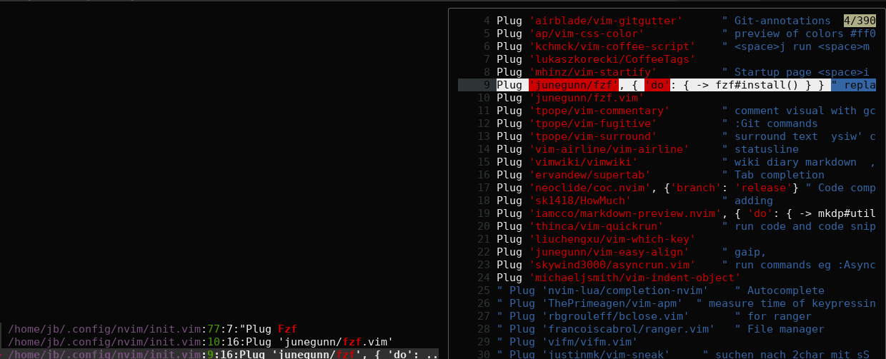

# Bookmarks for edited files

# Installation

Copy jb.vim to your computer and source it via .vimrc.

# Configuration

    let g:Jb_Linkfname = '/qsx/intra/2020/vimwiki/jbarbeit.md'
    let g:Jb_browser = 'brave-browser'
    let g:Jb_logfname = '/home/'.$USER.'/vim.log' " eg /home/jb/vim.log
    let g:Jb_tmpfname = '/tmp/jb.tmp'

The Jb_Linkfname determines, where to find the Markdown-links.
The jb_browser defines, wichbrowser ist started.

If you like the plugin, you want to invoke the functions really fast. 
I put the shortcuts this way:

    nnoremap <space>b   :call JbFzBrows('')<cr>
    nnoremap <space>e   :call JbFzEdit('')<cr>
    nnoremap <space>l   :call JbFzLink('')<cr> 
    nnoremap <space>r   :call JbFzGrep('')<cr> 

# How it works

This plugin writes a line with path and filename in the file vim.log every time you save a file.

JbEdit uses the vim.log to find useful information.
You can either search for filenames or paths and/or for content in those files.
The command for this action is named ":Je" for JbEdit.

You type ":Je init.vim#fzf" and you will be shown your vimrc and the
positions of the string fzf. 

You could also write a bookmark in an arbitrary file and link to "init.vim#fzf" 
by putting your cursor on that text and start the function with ":Je ."

The bookmark has two parts. The first part is a search expression for the file
The second part is the text, that is search in these files. If you use a dot for
one part, it is a wild card for all. ".#matrix" searches for matrix in all the 
files. "matrix#." lists the first line of all files. You can omit the following
"#.". "matrix" shows all files containing matrix in filename or path.

":Jr" is the same function, except it assumes to grep your word in all files
if the # is missing.
:Jr matrix  searches in all edited files for "matrix". Or you place the cursor
over the word matrix and start the funktion :Jr .&lt;enter&gt;

The workflow is similar to google the web, exept the database are all your edited
files.

I don't use the shada file of vim with the history of all visited files,
because this also has all files I only have read.
Maybe this could be an extra function. I would increase the amount of remembered
files with "set viminfo='100,<50,s10,h" to get a list of theses files in 
vimscript you can use v:oldfiles.

# Bookmarks for WWW in markdown.

The plugin assumes, you put all interesting Internetsites in a Markdownfile
You type ":Jl junegunn" and will see all your bookmarks, that contain junegunn
in the url or the text to this url on the same line. With <cr> you start
browsing this website.

# Dependencies

- vim plugin .#junegunn/fzf
- shell programm .#ripgrep
